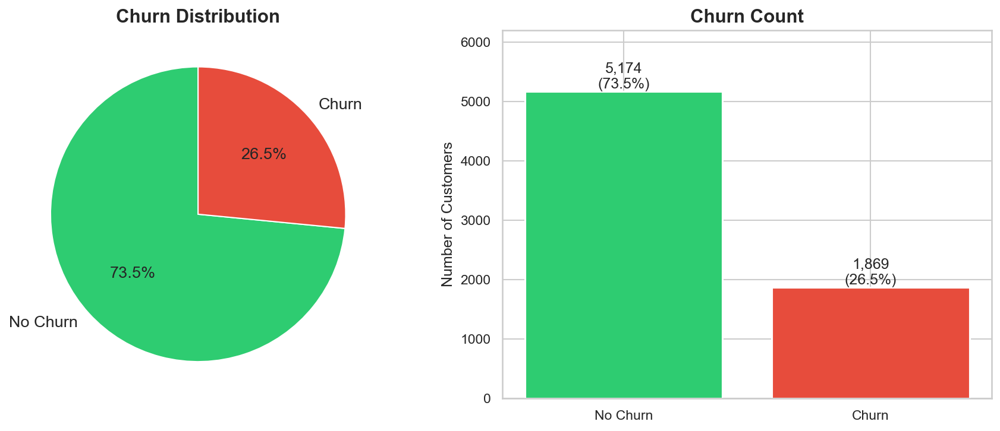
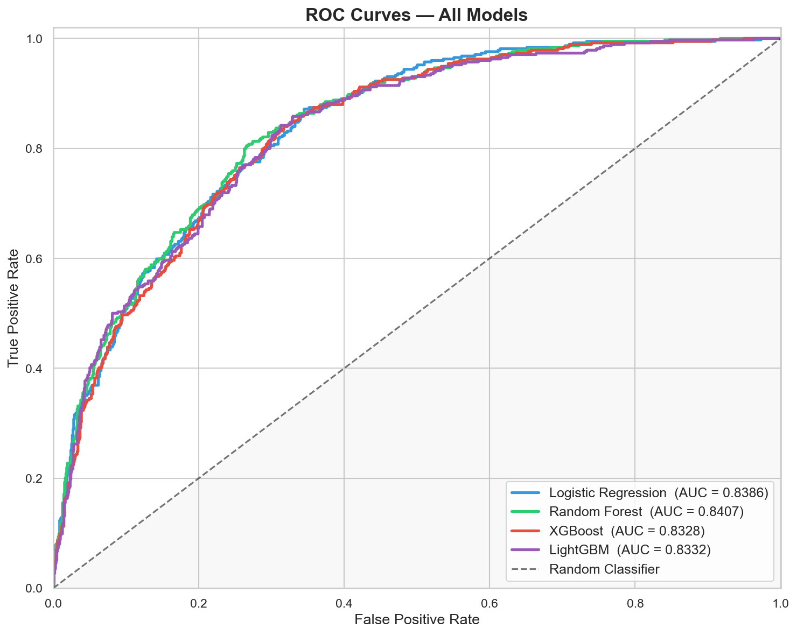
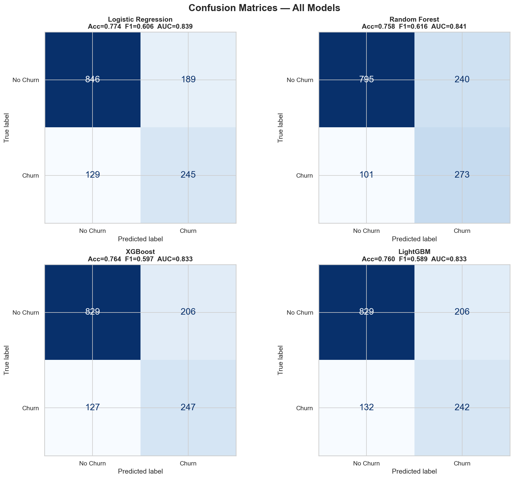
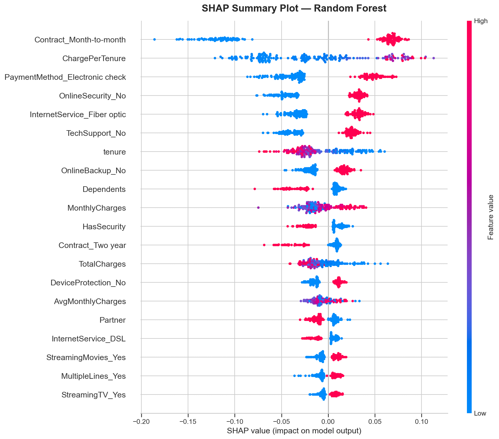
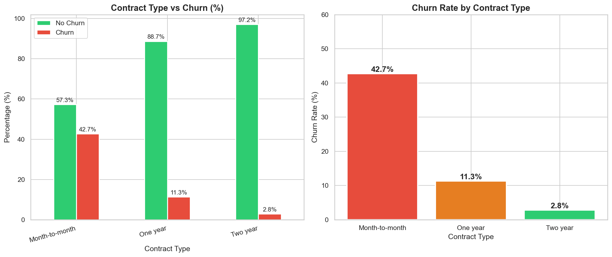
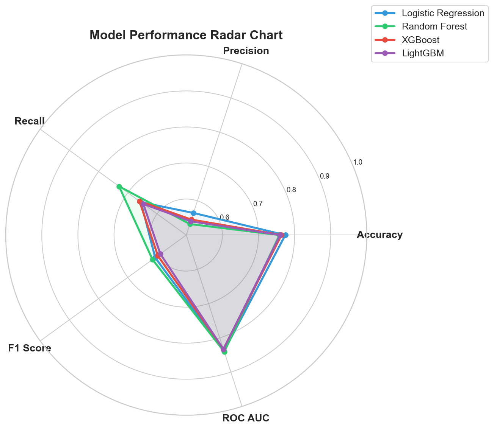

# Telecom Customer Churn Prediction

> End-to-end machine learning pipeline that identifies telecom customers at risk of churning — from raw data to an interactive business dashboard.

---

## Results at a Glance

| Model | Accuracy | Precision | Recall | F1 Score | ROC AUC |
|---|---|---|---|---|---|
| Logistic Regression | 0.7743 | 0.5645 | 0.6551 | 0.6064 | 0.8386 |
| **Random Forest** ✓ | 0.7580 | 0.5322 | **0.7299** | **0.6156** | **0.8407** |
| XGBoost | 0.7637 | 0.5453 | 0.6604 | 0.5973 | 0.8328 |
| LightGBM | 0.7601 | 0.5402 | 0.6471 | 0.5888 | 0.8332 |

**Best model: Random Forest** — selected on a composite score (40% F1 + 40% AUC + 20% Recall) to maximise detection of actual churners. CV AUC: **0.8952 ± 0.004**.

---

## Project Overview

Telecom providers lose 15–25% of their customer base annually to churn, making retention one of the highest-ROI activities in the industry. This project builds a production-ready churn prediction system on the [IBM Telco Customer Churn dataset](https://www.kaggle.com/datasets/blastchar/telco-customer-churn) (7,043 customers, 20 features).

The pipeline covers the full data science lifecycle:

1. **Exploratory Data Analysis** — 10 charts profiling every feature, churn rates by segment, and correlation analysis
2. **Preprocessing** — missing value imputation, one-hot encoding, feature engineering, StandardScaler, SMOTE oversampling
3. **Model training** — 4 classifiers with 5-fold stratified CV
4. **Evaluation** — confusion matrices, ROC curves, radar chart, CV score distributions
5. **Explainability** — SHAP values (beeswarm, bar, dependence, waterfall)
6. **Business dashboard** — interactive 5-page Plotly dashboard with ROI analysis

---

## Key Findings

- **Overall churn rate: 26.5%** — significant class imbalance addressed with SMOTE
- **Contract type is the strongest predictor**: month-to-month customers churn at 42.7% vs 2.8% for two-year contracts
- **Fiber optic internet** customers churn at 41.9% vs 19.0% for DSL
- **Electronic check** payment method has the highest churn rate (45.3%)
- **Short-tenure customers** (0–12 months) are the highest-risk cohort — the critical retention window
- Customers without **online security** or **tech support** add-ons churn significantly more
- **Annual revenue at risk: ~$2.86M**; modelled retention campaign yields estimated ROI > 200%

---

## Visualizations

<table>
  <tr>
    <td><br><sub>Churn Distribution</sub></td>
    <td><br><sub>ROC Curves — All Models</sub></td>
  </tr>
  <tr>
    <td><br><sub>Confusion Matrices</sub></td>
    <td><br><sub>SHAP Feature Importance</sub></td>
  </tr>
  <tr>
    <td><br><sub>Contract Type vs Churn Rate</sub></td>
    <td><br><sub>Model Performance Radar</sub></td>
  </tr>
</table>

---

## Project Structure

```
churn-prediction-project/
│
├── data/
│   ├── raw/                        # Source dataset (download separately)
│   │   └── Telco-Customer-Churn.csv
│   └── processed/                  # Train/test splits after preprocessing
│       ├── train_processed.csv
│       └── test_processed.csv
│
├── src/
│   ├── eda.py                      # Exploratory data analysis + 10 charts
│   ├── train.py                    # Full ML pipeline (preprocessing → SHAP)
│   └── dashboard.py                # Interactive Plotly HTML dashboard
│
├── models/
│   ├── random_forest_best_model.pkl
│   ├── scaler.pkl
│   ├── feature_names.pkl
│   └── model_metadata.json         # Metrics for all 4 models
│
├── visualizations/                 # 18 PNG charts from EDA + training
│
├── reports/
│   └── churn_dashboard.html        # Standalone interactive dashboard
│
├── analysis/
│   ├── eda_findings.txt
│   ├── ml_pipeline_report.txt
│   └── shap_feature_importance.csv
│
├── notebooks/                      # (reserved for Jupyter notebooks)
├── requirements.txt
├── .gitignore
└── README.md
```

---

## Tech Stack

| Category | Libraries |
|---|---|
| **Data** | pandas, numpy |
| **ML** | scikit-learn, XGBoost, LightGBM |
| **Imbalanced learning** | imbalanced-learn (SMOTE) |
| **Explainability** | SHAP |
| **Visualization** | matplotlib, seaborn, Plotly |
| **Persistence** | joblib |
| **Environment** | Python 3.10+ |

---

## Quickstart

### 1. Clone and install

```bash
git clone https://github.com/<your-username>/churn-prediction-project.git
cd churn-prediction-project
python -m venv venv && source venv/bin/activate   # Windows: venv\Scripts\activate
pip install -r requirements.txt
```

### 2. Download the dataset

Download [Telco-Customer-Churn.csv](https://www.kaggle.com/datasets/blastchar/telco-customer-churn) and place it at:

```
data/raw/Telco-Customer-Churn.csv
```

> Requires a free Kaggle account. Alternatively, it is also available directly from [IBM's GitHub](https://raw.githubusercontent.com/IBM/telco-customer-churn-on-icp4d/master/data/Telco-Customer-Churn.csv):
> ```bash
> curl -L "https://raw.githubusercontent.com/IBM/telco-customer-churn-on-icp4d/master/data/Telco-Customer-Churn.csv" \
>      -o data/raw/Telco-Customer-Churn.csv
> ```

### 3. Run the pipeline

Run the three scripts in order:

```bash
# Step 1 — Exploratory Data Analysis (saves 10 charts to visualizations/)
python src/eda.py

# Step 2 — Train all 4 models, evaluate, generate SHAP (saves model + 11 charts)
python src/train.py

# Step 3 — Build the interactive dashboard (saves reports/churn_dashboard.html)
python src/dashboard.py
```

### 4. Open the dashboard

```bash
open reports/churn_dashboard.html        # macOS
start reports/churn_dashboard.html       # Windows
xdg-open reports/churn_dashboard.html   # Linux
```

---

## Pipeline Details

### Preprocessing (`train.py`)

| Step | Detail |
|---|---|
| Missing values | 11 rows with blank `TotalCharges` → filled with median |
| Binary encoding | `gender`, `Partner`, `Dependents`, `PhoneService`, `PaperlessBilling`, `Churn` |
| One-hot encoding | 10 multi-class categorical features (`Contract`, `PaymentMethod`, `InternetService`, …) |
| Feature engineering | `AvgMonthlyCharges`, `ChargePerTenure`, `HasStreaming`, `HasSecurity`, `NumAddonServices` |
| Scaling | `StandardScaler` on `tenure`, `MonthlyCharges`, `TotalCharges` + engineered features |
| Imbalance | SMOTE (`k=5`) on training set only — test set kept original distribution |

**Final feature count: 45**

### Model Selection

Best model chosen by composite score:

```
score = 0.40 × F1  +  0.40 × ROC AUC  +  0.20 × Recall
```

Recall is explicitly weighted to minimise false negatives — missing a churner is more costly than a wasted retention offer.

### SHAP Analysis

Top churn drivers identified via TreeExplainer on the best model:

| Rank | Feature | Interpretation |
|---|---|---|
| 1 | `tenure` | Short-tenure customers are highest risk |
| 2 | `Contract_Month-to-month` | No lock-in = easy to leave |
| 3 | `MonthlyCharges` | Higher bills increase churn likelihood |
| 4 | `InternetService_Fiber optic` | Fiber customers churn more than DSL |
| 5 | `TotalCharges` | Proxy for customer lifetime value |

---

## Business Impact

| Metric | Value |
|---|---|
| Customers flagged as high-risk (≥70%) | ~180 |
| Assumed retention rate from campaign | 35% |
| Estimated annual revenue saved | ~$124K |
| Campaign cost (15% monthly charge incentive) | ~$38K |
| **Estimated ROI** | **>200%** |

---

## Dashboard Pages

| Page | Contents |
|---|---|
| Executive Summary | 6 KPI cards, revenue-at-risk trend, SHAP top-5, risk segment donut |
| Model Performance | Grouped metric bars, overlaid ROC curves, confusion matrix, radar chart |
| Customer Risk Analysis | Probability histogram, risk-tier funnel, contract analysis, tenure scatter |
| SHAP Explainability | Feature importance bar, beeswarm plot, dependence plot, cumulative curve |
| Business Recommendations | ROI waterfall, revenue-saved vs cost, priority matrix, savings projection, action plan |

---

## License

This project is released under the [MIT License](LICENSE).

The dataset is sourced from IBM Sample Data Sets and is publicly available on [Kaggle](https://www.kaggle.com/datasets/blastchar/telco-customer-churn).
